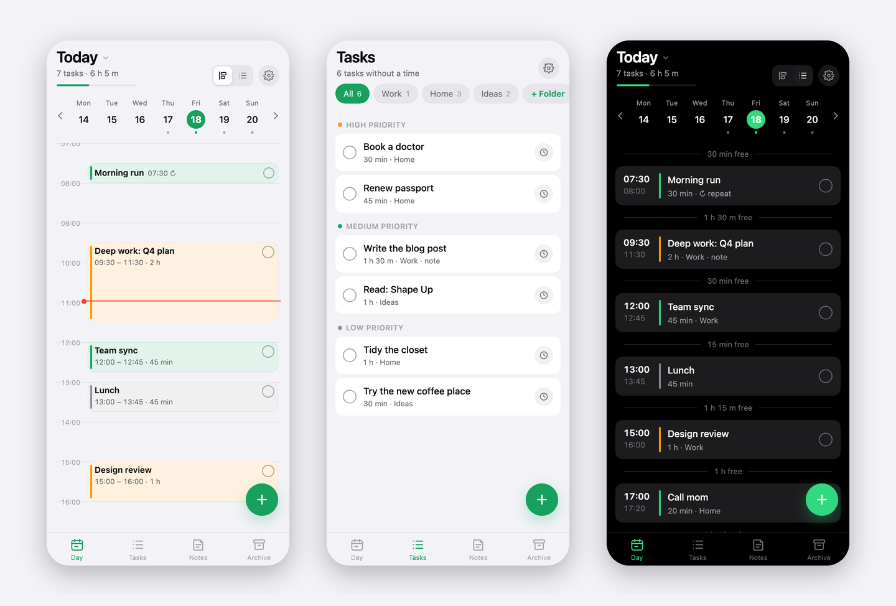
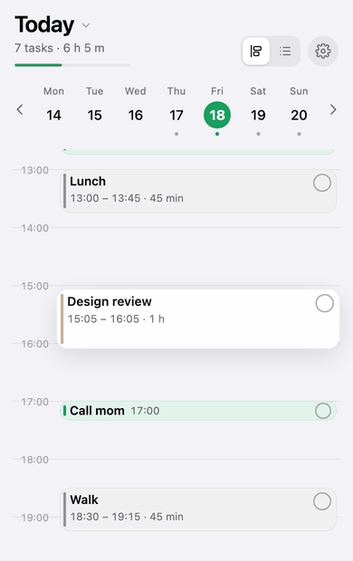

# Planly

**A minimalist day planner that lives in your browser.** One HTML file, no
framework, no accounts, no server required. Works offline, installs to the home
screen, and syncs between devices through a single access code when you want it to.

**[Live demo →](https://planly.site)** · [Русская версия →](README.ru.md)





- **Day** — a vertical timeline where each task is a block as tall as its duration. Tap a time to add, drag to move, pull the bottom edge to resize. Overlaps split into columns. A list view shows the same day as rows with free windows between tasks.
- **Repeats** — every day or chosen weekdays. Edits apply to one day; "apply to all future" pushes them down the series.
- **Calendar** — tap the date to open a month view; days with tasks are underlined.
- **Tasks** — things without a time, in folders you create, with three priorities. Drag to reorder or change priority; schedule into a free window or automatically.
- **Notes** — drafts by topic with headings, bullet and numbered lists, bold and italic. Saves as you type.
- **Archive** — completed items, grouped by day, auto-removed after two weeks.
- **Sync** — optional. One code = one shared list. Per-item merge by modification time, tombstones for deletions, offline-first.
- Light/dark theme, seven accent colors, six languages (en, ru, es, de, zh, hi), keyboard shortcuts on desktop.

Everything lives in the browser's storage on your device. The server, when you use one, holds a single JSON document per access code and knows nothing else.

<br clear="right">

> The demo's sync is invite-only (it's the author's instance); deploy your own in five minutes — see below.

---

## Try it locally

```bash
git clone https://github.com/<you>/planly && cd planly
python3 -m http.server 4321
```

Open http://localhost:4321. The app works fully offline once loaded; only sync needs a backend.

## Project layout

```
src/app.html          the whole app: styles, markup, logic (edit this)
src/i18n.js           UI translations, keyed by the Russian source string
build.sh              assembles index.html and dist/ from src/
deploy.sh             build + publish to Cloudflare Pages
index.html            built app (generated — do not edit)
sw.js                 service worker: offline cache, versioned per build
manifest.json         PWA manifest
icons/                app icons (make_icons.py regenerates them)
functions/api/sync.js sync API as a Cloudflare Pages Function (KV storage)
wrangler.example.toml Pages project config template (copy to wrangler.toml, git-ignored)
server/               self-hosted alternative: Node sync server, nginx and systemd examples
tools/shots/          headless-Chrome rig that renders the README screenshots
docs/                 screenshots, GIF and the social preview image
```

---

## Option A — Cloudflare Pages + KV (free, recommended)

Static files are served from Cloudflare's edge; the sync API runs as a Pages
Function backed by Workers KV. The free plan is more than enough: unlimited
static requests, 100k function calls/day, 1k KV writes/day (the app only writes
when something actually changed).

You need a Cloudflare account and Node.js 18+.

```bash
npx wrangler login                                     # opens the browser once
npx wrangler pages project create planly --production-branch=main
npx wrangler kv namespace create PLANLY_SYNC           # prints the namespace id
```

Copy the example config and put the printed id into it (`wrangler.toml` is
git-ignored, so your ids stay out of the repository):

```bash
cp wrangler.example.toml wrangler.toml     # then edit the id line
```

Then deploy:

```bash
./deploy.sh
```

The script builds `dist/`, stamps a new cache version into `sw.js` and uploads
everything with `wrangler pages deploy`. The app is live at
`https://planly-<hash>.pages.dev`; every later `./deploy.sh` ships an update
that installed home-screen apps pick up on their next launch.

**Custom domain.** If your domain's DNS is on Cloudflare: *Workers & Pages →
your project → Custom domains → Set up a custom domain*. Cloudflare creates the
DNS record and the certificate. If DNS is elsewhere, add a `CNAME` to
`planly-<hash>.pages.dev` (apex domains need CNAME flattening, which most
registrars lack — moving DNS to Cloudflare is the easy path).

**Restricting sync to known codes.** By default any code works. To allow only
specific codes (e.g. while the deployment is private), set a secret with a
comma-separated list:

```bash
printf 'AAAA-BBBB-CCCC-DDDD,EEEE-FFFF-GGGG-HHHH' | npx wrangler pages secret put ALLOWED_CODES --project-name planly
```

Other codes get `403 not_allowed` and the app shows "code not allowed on the server".
Delete the secret to open sync again.

> If `wrangler pages project create` complains about a missing `workers.dev`
> subdomain, re-run it once with `--force` to create a classic Pages project.

---

## Option B — your own server

The app is static: copy `index.html`, `sw.js`, `manifest.json`, `version.txt`
and `icons/` (all produced in `dist/` by `./build.sh`) to any web root behind
HTTPS. HTTPS is required for the service worker and for "Add to Home Screen".

For sync, run the reference server — a single Node file with no dependencies
that stores one JSON file per code:

```bash
PORT=8787 DATA_DIR=/var/lib/planly node server/sync-node.js
```

and proxy `/api/sync` to it from your web server. `server/nginx.example.conf`
is a complete nginx site (static files with correct cache headers + the proxy),
`server/planly-sync.service` a systemd unit. Set `ALLOWED_CODES` in the unit's
environment to restrict access, or leave it unset to allow any code.

The app calls `api/sync` relative to its own URL, so it works both at a domain
root and in a sub-folder.

**Any other backend** works too — the protocol is two endpoints:

```
GET  /api/sync?code=XXX                → 200 { version, updatedAt, doc }   (doc: null if none)
PUT  /api/sync?code=XXX  { base, doc } → 200 { version }
                                       → 409 { version, doc }  server is ahead: merge and retry
```

`version` is an integer that grows on every write; the client sends the
version it based its document on, so two devices writing at once never lose
data — the loser merges and retries. Codes are `[A-Za-z0-9-]{8,64}`; the client
generates 16 characters from a 32-symbol alphabet.

---

## Using the app

**Install.** Open the URL in Safari (iPhone) or Chrome (Android/desktop) →
Share → *Add to Home Screen* (Chrome: *Install app*). It launches full-screen,
works offline and checks for updates when you return to it.

**Day.** Tap an empty time to add a task there. Long-press a block (or just
drag with a mouse) to move it; the bottom edge changes duration. The circle in
the corner marks it done and sends it to the archive. The toggle in the header
switches between timeline and list; tap the date for the month calendar.

**Repeats.** In a scheduled task's card: *Repeat → Every day* or *Weekdays*.
The app creates the task on every matching day five weeks ahead. Edits in a
repeating task's card apply to that day only; *Apply to all future* pushes them
to the whole series, *Delete only this one* skips one day, *Delete all repeats*
removes the series (completed days stay in the archive).

**Tasks.** Untimed items with folders and priorities. Drag between priority
sections. The clock button opens scheduling: pick a date, a free window, a
manual time, or let it choose the first free window.

**Sync.** Settings → *Sync between devices* → *Enable* creates a code. On the
other device enter it under *Code from another device*. Devices exchange
changes on launch, when you return to the app, every two minutes, and a few
seconds after each edit. The code is the only key to your data — keep it like
a password. Losing it means losing the server copy (your device copy stays).

**Backup.** Settings → *Copy backup* puts the whole dataset as JSON on the
clipboard; *Paste from clipboard* restores it. Storage is per URL: the same app
opened at a different address starts empty.

**Keyboard (desktop).** `←`/`→` day, `T` today, `N` new task, `V` timeline/list,
`1`–`4` tabs, `Esc` close.

---

## How data is stored

| Layer | What | Where | Lifetime |
|---|---|---|---|
| App cache | `index.html`, icons, manifest | Service Worker cache, versioned per build | replaced on every update |
| Your data | tasks, folders, notes, series, settings | `localStorage`, key `planly.v1` | until you clear site data or delete the home-screen app |
| Sync copy | one JSON document | KV (or a file on your server), key = code | 400 days after the last write |

Sync merges per item: each task, note, folder and series carries the time of
its last change, the newer one wins. Deletions are kept as tombstones for 30
days so a device that was offline cannot resurrect them. Repeating tasks are
materialized with deterministic ids (`<series>@<date>`), so two devices that
create the same day independently converge on one record.

---

## Development

```bash
./build.sh            # src/ → index.html + dist/
./deploy.sh           # build + wrangler pages deploy
python3 make_icons.py # regenerate icons/
```

`build.sh` stamps the build time into the settings screen and `version.txt`;
the running app compares them to offer an update. `sw.js` is network-first:
online you always get fresh files, offline you get the cache.

**Adding a language:** add a block to `src/i18n.js` (keys are the Russian UI
strings; nouns with counts are objects with `one/few/many/other` forms chosen
via `Intl.PluralRules`) and a row to `LANGS` in `src/app.html`. Missing keys
fall back to Russian, so partial translations are visible rather than silent.

## License

MIT
