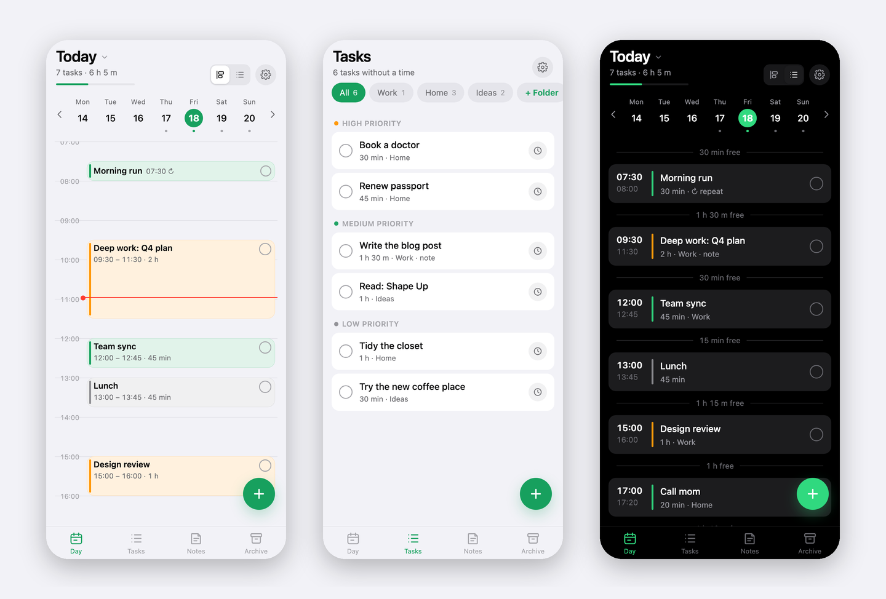
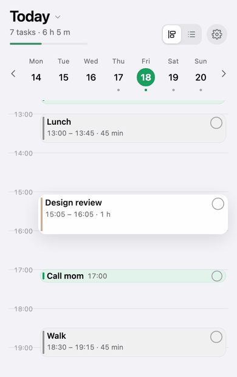

# Planly

**Минималистичный планировщик дня, который живёт в браузере.** Один HTML-файл,
без фреймворков, без аккаунтов, без обязательного сервера. Работает офлайн,
ставится на экран «Домой» и синхронизируется между устройствами по одному коду
доступа — если вам это нужно.

**[Живое демо →](https://planly.site)** · [English version →](README.md)





- **День** — вертикальная шкала, где каждое дело — блок высотой в свою длительность. Тап по времени добавляет, перетаскивание переносит, нижний край меняет длительность. Пересечения встают в колонки. Режим списка показывает тот же день строками со свободными окнами между делами.
- **Повторы** — каждый день или по дням недели. Правки касаются одного дня; «Применить ко всем будущим» — всей серии вперёд.
- **Календарь** — тап по дате открывает месяц; дни с делами подчёркнуты.
- **Задачи** — дела без времени, в папках по темам, с четырьмя приоритетами; верхний, «Срочно», обводит дело яркой красной рамкой везде, где оно показано. При удалении непустой папки приложение спрашивает: перенести задачи в общий список или удалить вместе с папкой. Перетаскивание меняет порядок и приоритет; постановка в свободное окно или автоматически.
- **Заметки** — наброски по темам с заголовками, списками, жирным и курсивом. Сохраняются по ходу набора.
- **Архив** — выполненное, по дням, чистится через две недели.
- **Разгрузка периода** — выбираете отрезок дней, и всё запланированное в нём уходит либо обратно в список задач (в папку с названием по диапазону, чтобы расставить заново), либо в заметку. Настройки → Инструменты или кнопка под календарём.
- **Дела ⇄ заметки** — любую папку (или весь список без времени) можно выгрузить в заметку простым текстовым форматом, отдать её LLM на структурирование, вставить обратно и нажать «В дела»: строки разойдутся по своим дням, а то, у чего нет времени, само встанет в свободное окно. В каждой строке есть метка `^id`, поэтому круг не плодит дубликаты, а обновляет те же дела.
- **Синхронизация** — по желанию. Один код = один общий список. Слияние поэлементно по времени правки, «могилки» для удалений, офлайн-первый подход.
- Светлая/тёмная тема, семь акцентных цветов, шесть языков (ru, en, es, de, zh, hi), горячие клавиши на компьютере.

Всё хранится в памяти браузера на вашем устройстве. Сервер, если вы им пользуетесь, держит один JSON-документ на код доступа и больше ничего не знает.

<br clear="right">

> В демо синхронизация только по приглашению (это авторский экземпляр); свой разворачивается за пять минут — см. ниже.

---

## Запустить локально

```bash
git clone https://github.com/<you>/planly && cd planly
python3 -m http.server 4321
```

Откройте http://localhost:4321. После загрузки приложение полностью работает офлайн; бэкенд нужен только синхронизации.

## Структура

```
src/app.html          всё приложение: стили, разметка, логика (правьте это)
src/i18n.js           переводы интерфейса, ключ — русская строка
build.sh              собирает index.html и dist/ из src/
deploy.sh             сборка + выкладка на Cloudflare Pages
index.html            собранное приложение (генерируется — не редактировать)
sw.js                 service worker: офлайн-кэш, версия на каждую сборку
manifest.json         манифест PWA
icons/                иконки (make_icons.py пересоздаёт)
functions/api/sync.js API синхронизации как функция Cloudflare Pages (хранилище KV)
wrangler.example.toml шаблон конфига Pages (копируется в wrangler.toml, тот в .gitignore)
server/               свой сервер: Node-сервер (приложение + синхронизация), примеры nginx и systemd
Dockerfile            весь экземпляр в одном контейнере
docker-compose.yml    то же самое, с именованным томом для данных
tools/shots/          стенд на headless Chrome, который рендерит скриншоты для README
docs/                 скриншоты, GIF и картинка для social preview
```

---

## Вариант А — Cloudflare Pages + KV (бесплатно, рекомендуется)

Статика раздаётся с узлов Cloudflare, API синхронизации работает как Pages
Function поверх Workers KV. Бесплатного тарифа хватает с запасом: запросы к
статике не ограничены, 100 тысяч вызовов функций в день, 1 000 записей в KV в
день (приложение пишет только когда что-то реально изменилось).

Нужны аккаунт Cloudflare и Node.js 18+.

```bash
npx wrangler login                                     # один раз откроет браузер
npx wrangler pages project create planly --production-branch=main
npx wrangler kv namespace create PLANLY_SYNC           # напечатает id хранилища
```

Скопируйте пример конфига и впишите в него id (`wrangler.toml` в
`.gitignore`, так что ваши идентификаторы в репозиторий не попадут):

```bash
cp wrangler.example.toml wrangler.toml     # и поправьте строку id
```

И выкладывайте:

```bash
./deploy.sh
```

Скрипт собирает `dist/`, штампует новую версию кэша в `sw.js` и загружает всё
через `wrangler pages deploy`. Приложение доступно на
`https://planly-<hash>.pages.dev`; каждый следующий `./deploy.sh` выкатывает
обновление, которое установленные на экран приложения подхватят при следующем запуске.

**Свой домен.** Если DNS домена на Cloudflare: *Workers & Pages → проект →
Custom domains → Set up a custom domain*. Cloudflare сам создаст запись и
сертификат. Если DNS в другом месте — добавьте `CNAME` на
`planly-<hash>.pages.dev` (для корневого домена нужен CNAME flattening, которого
у большинства регистраторов нет; проще перенести DNS на Cloudflare).

**Ограничить синхронизацию известными кодами.** По умолчанию работает любой
код. Чтобы пускать только конкретные (например, пока проект закрытый), задайте
секрет со списком через запятую:

```bash
printf 'AAAA-BBBB-CCCC-DDDD,EEEE-FFFF-GGGG-HHHH' | npx wrangler pages secret put ALLOWED_CODES --project-name planly
```

Остальные получат `403 not_allowed`, а приложение покажет «код не разрешён на
сервере». Удалите секрет — и синхронизация снова открыта.

> Если `wrangler pages project create` жалуется на отсутствие поддомена
> `workers.dev`, выполните команду один раз с `--force` — создастся классический
> проект Pages.

---

## Вариант Б — Docker (один контейнер: приложение и синхронизация)

```bash
git clone https://github.com/drkokorev/Planly && cd Planly
docker compose up -d
```

Это всё: на http://localhost:8080 с одного адреса работают и приложение, и API
синхронизации, документы лежат в именованном томе. Через обычный docker так же:

```bash
docker build -t planly .
docker run -d -p 8080:8080 -v planly-data:/data --name planly planly
```

Поставьте это за свой обратный прокси с сертификатом — service worker, офлайн и
«На экран „Домой“» требуют защищённого соединения.

Образ на `node:22-alpine`, ставить нечего (зависимостей нет), работает от
непривилегированного пользователя `node`, есть healthcheck. Полезные переменные:

| Переменная | По умолчанию | Что делает |
|---|---|---|
| `PORT` / `HOST` | `8080` / `0.0.0.0` | где слушать |
| `DATA_DIR` | `/data` | по одному JSON на код доступа |
| `ALLOWED_CODES` | не задана | белый список кодов через запятую; без неё принимается любой |
| `SERVE_STATIC` | включено | `0` отключает раздачу статики (только API) |

Обновление: `git pull && docker compose up -d --build`. Данные лежат в томе, а не в образе.

## Вариант В — свой сервер, без Docker

Приложение статическое: скопируйте `index.html`, `sw.js`, `manifest.json`,
`version.txt` и `icons/` (всё это `./build.sh` кладёт в `dist/`) в любой
веб-корень за HTTPS. HTTPS обязателен для service worker и для «На экран „Домой“».

Для синхронизации запустите эталонный сервер — один Node-файл без зависимостей,
хранящий по JSON-файлу на код:

```bash
PORT=8787 DATA_DIR=/var/lib/planly SERVE_STATIC=0 node server/sync-node.js
```

и проксируйте на него `/api/sync` со своего веб-сервера.
`server/nginx.example.conf` — готовый сайт для nginx (статика с правильными
заголовками кэша + прокси), `server/planly-sync.service` — юнит systemd.
Переменная `ALLOWED_CODES` в окружении ограничивает доступ; без неё принимается любой код.

Тот же файл умеет раздавать и само приложение вместо nginx — уберите
`SERVE_STATIC=0` и укажите `STATIC_DIR` на папку с `index.html`. Ровно это и
делает Docker-образ.

Приложение обращается к `api/sync` относительно своего адреса, поэтому
одинаково работает и в корне домена, и в подпапке.

**Любой другой бэкенд** тоже подойдёт — протокол из двух эндпоинтов:

```
GET  /api/sync?code=XXX                → 200 { version, updatedAt, doc }   (doc: null, если пусто)
PUT  /api/sync?code=XXX  { base, doc } → 200 { version }
                                       → 409 { version, doc }  на сервере новее: слить и повторить
```

`version` — целое число, растущее на каждую запись; клиент присылает версию, на
которой основывался, поэтому одновременная запись с двух устройств ничего не
теряет — проигравший сливает и повторяет. Коды — `[A-Za-z0-9-]{8,64}`; клиент
генерирует 16 символов из алфавита в 32 знака.

---

## Как пользоваться

**Установка.** Откройте адрес в Safari (iPhone) или Chrome (Android, компьютер)
→ Поделиться → *На экран «Домой»* (в Chrome — *Установить приложение*).
Запускается на весь экран, работает офлайн, проверяет обновления при возврате.

**День.** Тап по пустому времени добавляет дело туда. Долгое нажатие на блок
(мышью — просто тянуть) переносит его; нижний край меняет длительность. Кружок
в углу отмечает выполненным и отправляет в архив. Переключатель в шапке —
шкала или список; тап по дате — календарь месяца.

**Повторы.** В карточке дела со временем: *Повтор → Каждый день* или *По дням*.
Приложение создаёт дело на каждый подходящий день на пять недель вперёд.
Правки в карточке повторяющегося дела — только для этого дня; *Применить ко всем
будущим* — на всю серию, *Удалить только это* пропускает день, *Удалить все
повторы* убирает серию (выполненные дни остаются в архиве).

**Задачи.** Дела без времени с папками и приоритетами. Перетаскивание между
секциями приоритета. Кнопка с часами открывает планирование: дата, свободное
окно, ручное время или «Автоматически» — первое свободное окно.

**Синхронизация.** Настройки → *Синхронизация между устройствами* → *Включить*
создаёт код. На втором устройстве введите его в поле *Код с другого*. Обмен идёт
при запуске, при возвращении в приложение, каждые две минуты и через несколько
секунд после правки. Код — единственный ключ к данным, храните как пароль.
Потеря кода означает потерю копии на сервере (копия на устройстве остаётся).

**Резервная копия.** Настройки → *Скопировать резервную копию* кладёт весь
набор данных в буфер как JSON; *Вставить из буфера* восстанавливает. Хранилище
привязано к адресу: то же приложение по другому адресу откроется пустым.

**Клавиши (компьютер).** `←`/`→` день, `T` сегодня, `N` новое дело, `V`
шкала/список, `1`–`4` вкладки, `Esc` закрыть.

---

## Формат заметки

Любая папка или диапазон дней выгружается в заметку такого вида:

```
## 2026-10-05
- 09:00 1h Созвон с командой #{Работа} !high ^mwt6lle
- 10:30 1h30m Написать отчёт #{Работа} !high ^2e3968e
- 1h Спортзал ^ocnmfdr
## backlog
- 30m Записаться к врачу #{Дом} !low ^o2tud57
```

`## ГГГГ-ММ-ДД` открывает день, `## backlog` — список без времени. Строка —
`- [ЧЧ:ММ] [длительность] название [#{папка}] [!low|!med|!high|!urgent] [^id]`, всё
кроме названия необязательно. Не указали время — дело само встанет в первое
свободное окно этого дня. Длительность пишется как `45m`, `1h`, `1h30m`
(русские `ч`/`м` тоже понимаются). Метка `^id` — то, благодаря чему круг
обновляет существующие дела, а не плодит копии: LLM должна переносить её без
изменений, а строки без метки просто станут новыми делами.

Чтобы применить заметку, нажмите в ней **«В дела»**. Приложение сначала
покажет, что разобрало — сколько строк, сколько обновится, сколько дней
затронуто — и только потом меняет данные; результат можно отменить.

## Как хранятся данные

| Слой | Что | Где | Срок |
|---|---|---|---|
| Кэш приложения | `index.html`, иконки, манифест | кэш Service Worker, версия на сборку | заменяется при каждом обновлении |
| Ваши данные | дела, папки, заметки, серии, настройки | `localStorage`, ключ `planly.v1` | пока не очистите данные сайта или не удалите иконку |
| Копия синхронизации | один JSON-документ | KV (или файл на вашем сервере), ключ — код | 400 дней с последней записи |

Слияние поэлементное: у каждого дела, заметки, папки и серии хранится время
последней правки, побеждает свежая. Удаления хранятся «могилками» 30 дней,
чтобы устройство, бывшее офлайн, не воскресило их. Повторяющиеся дела создаются
с предсказуемыми id (`<серия>@<дата>`), поэтому два устройства, создав один и
тот же день независимо, сходятся к одной записи.

---

## Разработка

```bash
./build.sh            # src/ → index.html + dist/
./deploy.sh           # сборка + wrangler pages deploy
python3 make_icons.py # пересобрать icons/
```

`build.sh` штампует время сборки в экран настроек и в `version.txt`; работающее
приложение сравнивает их и предлагает обновиться. `sw.js` работает по принципу
«сначала сеть»: онлайн всегда свежие файлы, офлайн — кэш.

**Добавить язык:** добавьте блок в `src/i18n.js` (ключи — русские строки
интерфейса; существительные со счётом — объекты с формами `one/few/many/other`,
выбираемыми через `Intl.PluralRules`) и строку в `LANGS` в `src/app.html`.
Отсутствующие ключи показываются по-русски, так что неполный перевод виден, а не молчит.

## Лицензия

MIT
